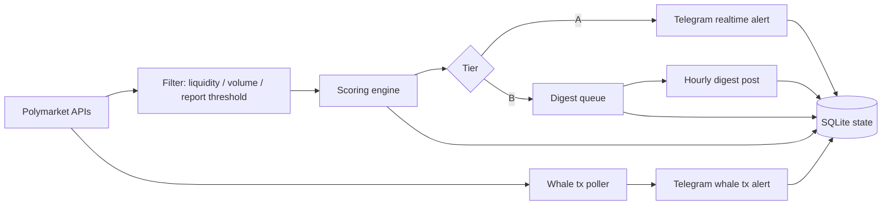

# Polymarket Radar

Polymarket Radar is a **read-only Telegram bot** that monitors active Polymarket markets and posts only high-signal updates.

It is built for signal quality over noise:
- **Tier A** signals go out immediately.
- **Tier B** signals are queued into an hourly digest.
- Duplicate/repeated alerts are controlled with SQLite-backed state.

## What it tracks
- Market repricing (probability moves)
- Liquidity and volume filters
- Trade-flow spikes
- Whale-sized flow and single whale transactions
- Volatility/flip risk to reduce noisy re-alerting

## How it works


## Quick start (local)
```bash
cp .env.example .env
npm ci
npm run dev
```

## Docker (local)
```bash
cp .env.example .env
docker compose -f docker-compose.local.yml up -d --build
```

## Required environment variables
At minimum:

```env
TELEGRAM_BOT_TOKEN=...
TELEGRAM_CHANNEL_ID=@your_channel
```

Everything else has defaults in `.env.example`.

## Important behavior defaults
- `MIN_REPORT_LIQUIDITY` guardrail is enabled (low-liquidity markets are fully ignored).
- `POST_TIER_B_IN_DIGEST=true` (Tier B is digest-first).
- Whale transaction poller is enabled by default.

## Useful commands
```bash
npm run check                # TypeScript type-check
npm run build                # compile to dist/
npm run analyze:last4d       # summary of sent messages (last 4 days)
npm run analyze:days -- 7    # custom analysis window
```

## Tech stack
- Node.js + TypeScript
- SQLite (`better-sqlite3`) for state, dedupe, and sent-message logs
- Docker / Docker Compose for containerized runtime
