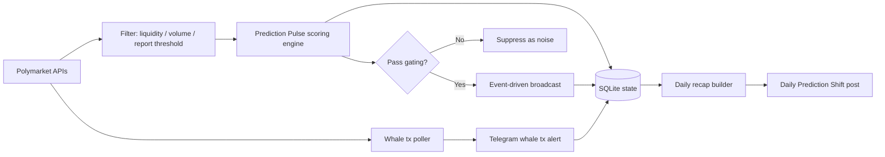

# Polymarket Radar

Polymarket Radar is a **read-only Telegram bot** that monitors active Polymarket markets and posts only high-signal updates.

It is built for signal quality over noise:
- **Prediction Pulse broadcasts** are event-driven (importance/novelty first, no hourly timer).
- **Daily Prediction Shift recap** posts once/day with biggest expectation changes and follow-through.
- Duplicate/repeated alerts are controlled with SQLite-backed state, cooldowns, and daily caps.

## What it tracks
- Conviction Spike / Regime Shift / Consensus Crack / Coordinated Whale Flow broadcasts
- Predictive confidence scoring (MoveQuality + MoneyQuality + MarketQuality - Stability penalties)
- Liquidity, spread proxy, flow, trade count, wallet diversity, and whale participation
- Anti-noise guardrails: cooldowns, per-market daily cap, repeat penalties
- Whale-sized single transaction alerts (separate poller)

## How it works


## Quick start (local)
```bash
cp .env.example .env
npm ci
npm run dev
```

## Docker (local)
```bash
cp .env.example .env
docker compose -f docker-compose.local.yml up -d --build
```

## Required environment variables
At minimum:

```env
TELEGRAM_BOT_TOKEN=...
TELEGRAM_CHANNEL_ID=@your_channel
```

Everything else has defaults in `.env.example`.

## Important behavior defaults
- `MIN_REPORT_LIQUIDITY` guardrail is enabled (low-liquidity markets are fully ignored).
- `POST_TIER_B_IN_DIGEST` is deprecated by v3 broadcast routing (kept for backward compatibility).
- Whale transaction poller is enabled by default.

## Useful commands
```bash
npm run check                # TypeScript type-check
npm run build                # compile to dist/
npm run analyze:last4d       # summary of sent messages (last 4 days)
npm run analyze:days -- 7    # custom analysis window
```

## Tech stack
- Node.js + TypeScript
- SQLite (`better-sqlite3`) for state, dedupe, and sent-message logs
- Docker / Docker Compose for containerized runtime
